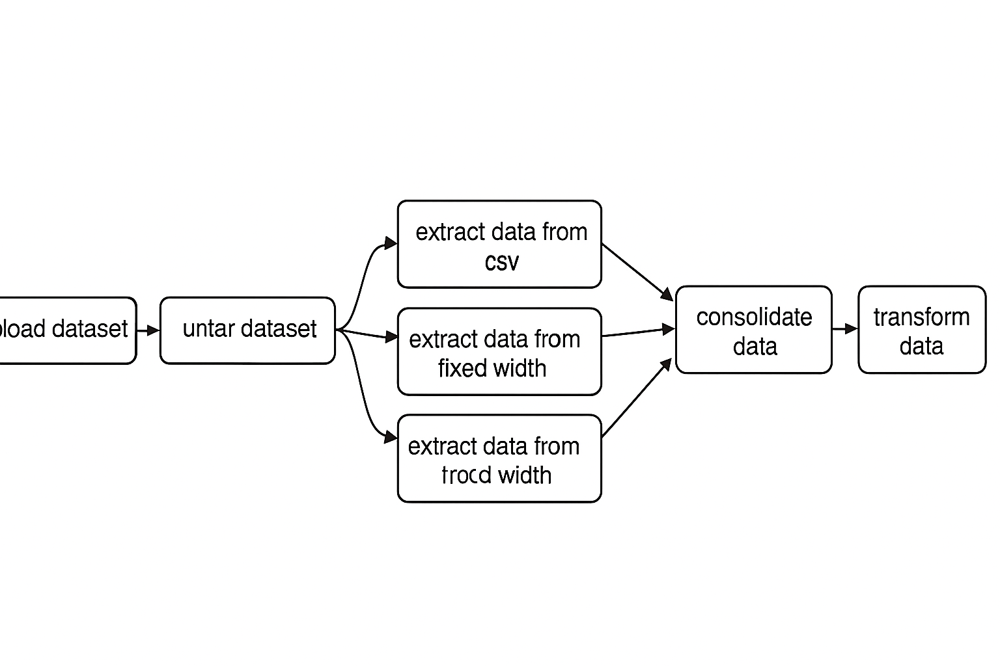

# 🚦 Projet ETL avec Apache Airflow – Analyse du trafic routier

## 📖 Scénario: 

En tant qu’ **Ingénieur de données** dans une société de conseil en analytique, j’ai été chargé d’un projet stratégique visant à **décongestionner les autoroutes nationales**. L’objectif est d’analyser les données de trafic routier collectées à partir de différents postes de péage. Chaque autoroute est exploitée par un opérateur distinct, avec une configuration informatique propre et des formats de fichiers hétérogènes (CSV, TSV, Fixed-Width).  
**Ma mission** : **collecter, transformer et consolider ces données dans un fichier unique**, afin de les rendre exploitables pour les équipes d’analystes et de décideurs.
pour ce faire j'utilise Apache Airflow pour orchestrer un pipeline **ETL complet** : téléchargement, extraction multi-formats, consolidation et transformation des données.  

## 🎯 Objectifs du projet
- **Centraliser** les données provenant de multiples sources et formats.
- **Automatiser** le pipeline de traitement de données hétérogènes (CSV, TSV, Fixed-Width) grâce à Apache Airflow.
- **Orchestrer** les tâches avec Apache Airflow pour un pipeline fiable et maintenable.
- **Normaliser et transformer** les données pour les rendre exploitables et prêtes à l’analyse.
- **Fournir un fichier consolidé** prêt pour l’analyse et la prise de décision.
- **Montrer** mes compétences pratiques en Data Engineering à travers un projet concret.
---

## 🛠️ Technologies utilisées
- **Python 3** : langage principal pour l’ETL.
- **Apache Airflow** : orchestration et automatisation des tâches.
- **Requests** : téléchargement des données.
- **Tarfile / CSV** : extraction et manipulation des fichiers.
- **Pendulum** : gestion des dates dans Airflow.

---
📂 Structure du projet

python-etl-airflow

- **dags**
     - **etl_toll_data.py**   
- **staging**                     
- **requirements.txt**           
- **README.md**                  
- **.gitignore**                  
- **LICENSE**

## 🔎 Explication étape par étape du pipeline

### 1️⃣ **Download dataset**
- **Méthode utilisée :** `requests.get()` avec gestion du flux et timeout.
- **Objectif :** Télécharger un fichier compressé `.tgz` depuis une source externe.
---

### 2️⃣ **Untar dataset**
- **Méthode utilisée :** `tarfile.open()` pour extraire les fichiers.
- **Objectif  :** Décompresser le jeu de données brut.
---

### 3️⃣ **Extract data (CSV, TSV, Fixed-Width)**
- **Méthodes utilisées :**
  - `csv.writer()` pour normaliser les données.
  - `split(',')`, `split('\t')` et slicing pour gérer différents formats.
- **Objectif  :** Extraire et uniformiser les données de trois formats distincts.
---

### 4️⃣ **Consolidate data**
- **Méthode utilisée :** `zip()` pour fusionner les lignes des trois fichiers.
- **Objectif  :** Créer un fichier unique `extracted_data.csv` regroupant toutes les informations.
 
---

### 5️⃣ **Transform data**
- **Méthode utilisée :** `csv.DictReader()` et `DictWriter()` pour manipuler les colonnes.
- **Objectif  :** Nettoyer et transformer les données (ex. mettre les types de véhicules en majuscules).

---

## 📊 Architecture du DAG Airflow

Download → Untar → [Extract CSV, Extract TSV, Extract Fixed-Width] → Consolidate → Transform

Chaque tâche est définie comme un **PythonOperator** et reliée par des dépendances claires, garantissant un pipeline **fiable et reproductible**.

---

## 📊 Schéma du pipeline ETL – DAG Airflow

Voici une représentation visuelle du pipeline ETL orchestré avec Apache Airflow :

### 🧭 Légende des étapes

- **Download Dataset** : Télécharge le fichier compressé contenant les données de péage.
- **Untar Dataset** : Décompresse le fichier `.tgz` pour accéder aux fichiers sources.
- **Extract CSV / TSV / Fixed-Width** : Traite les trois formats de fichiers utilisés par les différents opérateurs de péage.
  - `vehicle-data.csv` → données de véhicules
  - `tollplaza-data.tsv` → données de péage
  - `payment-data.txt` → données de paiement
- **Consolidate Data** : Fusionne les trois sources en un fichier unique `extracted_data.csv`.
- **Transform Data** : Nettoie et transforme les données (ex. majuscules sur les types de véhicules) pour produire `transformed_data.csv`.

Ce DAG illustre une orchestration claire, modulaire et robuste, adaptée à des environnements de production.

---

💼 Compétences démontrées

Ce projet m’a permis de mettre en œuvre plusieurs compétences clés du métier d’ingénieur de données :

🔁 Orchestration de workflows avec Apache Airflow : définition de tâches, gestion des dépendances, planification quotidienne.

🧩 Traitement multi-formats : extraction de données depuis des fichiers CSV, TSV et Fixed-Width, chacun issu d’un système différent.

🧠 Consolidation intelligente : fusion de sources hétérogènes en un fichier unique et cohérent.

🧹 Transformation de données : nettoyage, normalisation et mise en forme pour faciliter l’analyse.

🛠️ Robustesse du code : gestion des erreurs, chemins relatifs, modularité et réutilisabilité.

📦 Structuration d’un projet GitHub professionnel : documentation claire, schéma visuel, installation guidée.

---

💡 Leçons apprises

- L’importance de l’automatisation : Airflow permet de fiabiliser les processus et de réduire les interventions manuelles.

- La diversité des formats de données : dans un contexte réel, les données ne sont jamais homogènes — il faut savoir s’adapter.

- La valeur de la clarté : un code bien structuré et documenté est aussi important que sa performance.

- Le lien entre technique et métier : comprendre le besoin métier (décongestion des autoroutes) permet de mieux orienter les choix techniques.

---

**Ce dépôt illustre ma capacité à concevoir des workflows robustes, automatisés et réutilisables, qualités essentielles pour un Data Engineer.**

👨‍💻 Auteur

- **Nom** : El Hadji Ablaye Galoup DIOP 📧
- **Email** : elhadjiablayegaloupdiop@gmail.com �
